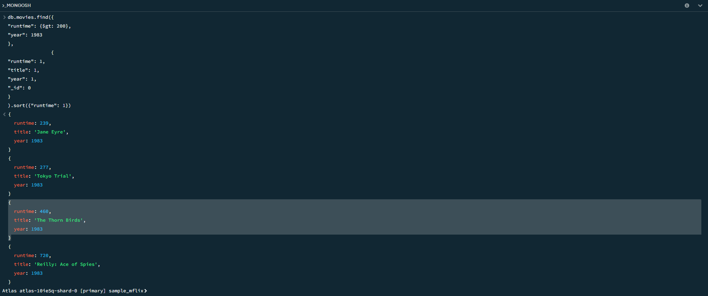

# Assignment-3-MongoDB-Setup-and-Queries

## About
* This repo is simply to show that I have:
  * Signed up for MongoDB Atlas
  * Installed MongoDB Community Edition
  * Ran quieries in MongoDB Compass
* This repo contains no code. All results are screenshots seen in the Readme.

## Visual of the Project

### Query 1
Shows all movies with a runtime greater than 200 minutes in the year 1983. It is sorted in increasing order bu rintime. It shows the 3 fields of rintime, title, and year.
* 
### Query 2
Shows all movies after the year 2014 with an imdb rating greater than 9. It also shows title, directors, year, and the imdb rating.
* 
### Preview of cluster
* 
